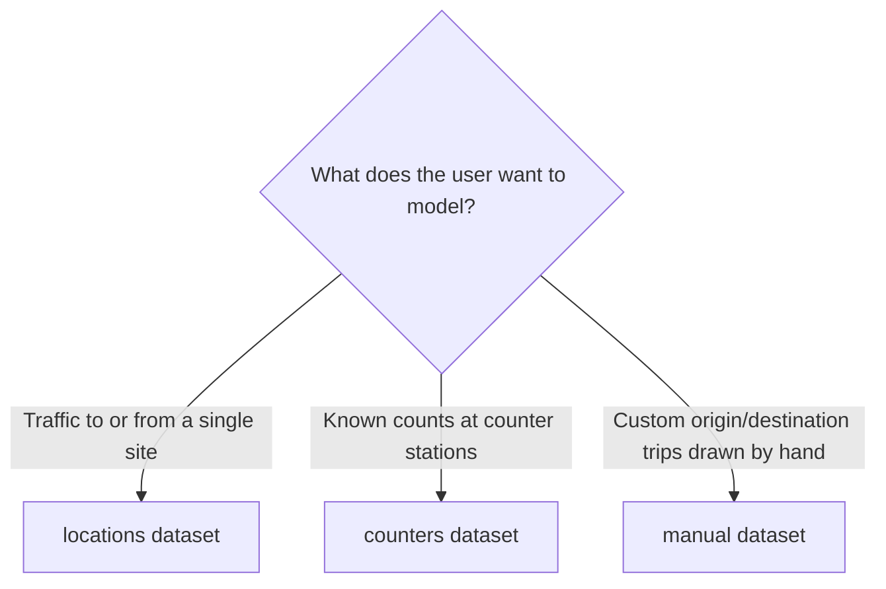

# ANYWAYS Datasets

A **dataset** is a collection of locations and trips inside a project. It has one of three configurations and is linked to one or more **scenarios** so it can feed them with traffic.

```
Project
  ├── Dataset (configuration: manual | counters | locations)
  │      ├── locations[]   ── points on the map
  │      └── trips[]       ── origin → destination, with profile + count
  └── Scenario ── link_dataset_to_scenario ── Dataset
```

## When to use this skill

- Picking the right dataset type for a study question.
- Creating a dataset and linking it to a scenario.
- Adding/removing locations or trips on an existing dataset.
- Exporting a dataset as GeoJSON.

For the surrounding project/scenario model, use the `anyways-projects` skill. To add the MCP server in the first place, see `anyways-mcp`.

## Choosing a dataset type



| Type | What it represents | Typical use |
| --- | --- | --- |
| `locations` | One Location of Interest + auto-generated surrounding points | "Where does traffic to/from this site come from?" |
| `counters` | Counter stations with origin/destination counts | Calibrating against measured traffic counts |
| `manual` | Hand-drawn origin/destination trips with chosen profile and count | Custom what-if studies, small bespoke flows |

All three use the same underlying locations + trips data model. The `configuration` field on the dataset tells the app which UI / map mode to use.

## Key tools

| Tool | Use |
| --- | --- |
| `create_dataset` | Create an empty manual dataset |
| `create_counter_dataset` | Create a counter dataset |
| `create_locations_dataset` | Create an LOI dataset and auto-generate random surrounding points and trips |
| `add_dataset_locations` / `delete_dataset_locations` | Manage points |
| `add_dataset_trips` | Add origin-destination trips |
| `add_counter_dataset_locations` | Add counter origins/destinations with counts |
| `generate_counter_segments` | Derive counter entry/exit segments from polygon-road intersections |
| `link_dataset_to_scenario` | Attach the dataset to a scenario (required to take effect) |
| `update_dataset` / `delete_dataset` | Rename, edit metadata, or delete |
| `get_dataset` | Read full dataset detail |
| `download_dataset` | Export as GeoJSON |
| `list_profiles` | List available routing profiles (e.g. `car.fast`) |

## Locations dataset (LOI)

Places a single Location of Interest and auto-generates random surrounding points inside concentric **donut rings** around it. Trips connect the LOI to each generated point.

```
create_locations_dataset(
  name="Routes to Office Center",
  projectId="<project-guid>",
  longitude=4.989, latitude=51.165,
  isOrigin=false,            # false = traffic TOWARDS LOI; true = AWAY from LOI
  profile="car.fast",        # see list_profiles for options
  donutsJson='[{"size":300,"count":0},{"size":1200,"count":100}]'
)
```

**Donut rings.** Sizes are cumulative widths in metres. The default `[{size:300,count:0},{size:1200,count:100}]` means:

- 0–300 m around the LOI: dead zone, 0 points.
- 300–1500 m around the LOI: 100 random points.

A wider study area = larger outer ring or additional rings further out.

**Direction.** `isOrigin=false` makes the LOI the trip *destination* (traffic flowing in). `isOrigin=true` makes it the *origin* (traffic flowing out). For a "where do our visitors come from" question, use `false`.

## Counters dataset

Represents counter stations with origin and destination locations and their measured counts.

```
create_counter_dataset(name="...", projectId="<project-guid>")
add_counter_dataset_locations(datasetId="<ds-guid>", ...)  # add counter points
generate_counter_segments(...)                              # derive entry/exit segments
```

Use counter datasets to calibrate against measured field data rather than synthetic donut points.

## Manual dataset

A blank canvas. Create the dataset, then add locations and trips programmatically — or edit them in the ANYWAYS app where the user can draw origin/destination pairs by clicking on the map.

```
create_dataset(name="...", projectId="<project-guid>", configuration="manual")
add_dataset_locations(datasetId="<ds-guid>", locations=[...])
add_dataset_trips(datasetId="<ds-guid>", trips=[...])
```

Each trip has an origin, destination, routing `profile`, and `count`.

## Linking to a scenario

A dataset belongs to a project but does not contribute to any analysis until it is linked to a scenario:

```
link_dataset_to_scenario(datasetId="<ds-guid>", scenarioId="<scenario-guid>")
```

Get the scenario IDs from `get_project` (see the `anyways-projects` skill).

## Routing profiles

`list_profiles` returns the available routing profiles grouped by vehicle type. The default for locations/manual datasets is `car.fast`. Other typical profiles cover bicycles and pedestrians. Pick the profile that matches the trip mode you are studying.

## Exporting

```
download_dataset(datasetId="<ds-guid>")
→ GeoJSON FeatureCollection (points = locations, lines = trips)
```

Useful for offline analysis, mapping in QGIS, or sharing with stakeholders.

## Typical workflow: LOI study

1. Project ready (use the `anyways-projects` skill).
2. `create_locations_dataset` at the site's lat/lon with `isOrigin=false`.
3. `link_dataset_to_scenario` to the baseline scenario from `get_project`.
4. Open in the app: `https://www.anyways.eu/app/scenario/<scenario-id>` to review and refine.

## Notes and gotchas

- **`longitude` is first** in MCP calls and GeoJSON, but `latitude` is first in human conversation. Double-check the order, especially for places near the equator or prime meridian where the swap is not visually obvious.
- **Donut sizes are cumulative widths**, not absolute radii. `[{size:300,count:0},{size:1200,count:100}]` produces an outer ring at 1500 m (300 + 1200), not 1200 m.
- **A dataset only affects a scenario if explicitly linked.** Creating a dataset is not enough — call `link_dataset_to_scenario` afterwards.
- **`isOrigin`** flips trip direction. Setting it incorrectly will produce results that look right on the map but model the opposite traffic flow.
- **Profiles must exist.** If `list_profiles` does not list the profile name you intend to use, the dataset will route with whatever default the engine falls back to. Use `list_profiles` first when in doubt.
